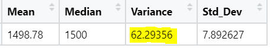
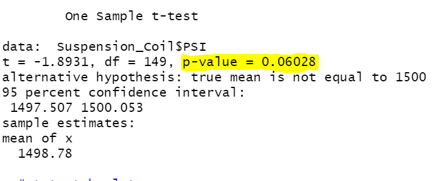
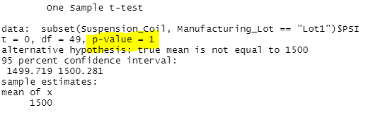
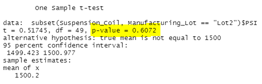
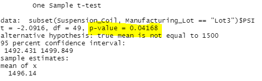

# MechaCar_Statistical_Analysis

## Overview

A car company has a new prototype, the MechaCar. It is suffering from production troubles and blocking the manufacturing team’s progress. Reviewing and analyzing the production data should givr insights that may help the manufacturing team. I will achieve these statistics by performing a multiple linear regression analysis to identify which variables in the dataset predict the mpg of MechaCar prototypes, collect summary statistics on the pounds per square inch (PSI) of the suspension coils from the manufacturing lots and run t-tests to determine if the manufacturing lots are statistically different from the mean population.

## Linear Regression to Predict MPG

Each Pr value in the table above is seen as the probabilty each coefficient gives a random amount of varience to the linnear model. The Intercept coefficent is considered to be the slope value.

Q1: Which variable coefficients provided a non-random amount of variance to the mpg values in the dataset? 

A1: Using the MechaCar_mpg dataset, vehicle_length and ground clearance are statistically significant. This means vehicle_length and ground_clearance have an impact on mpg.

Q2: IS the slope of the linear model considered to be zero? why or why not? 

A2: The slope is not considered to be zero because the intercept coefficent is significant (less than .05). 

Q3: Does the linear model predict miles per gallon? why or why not?

A3: The Multiple R-squared was 0.71 says that the model does a sufficient job at predicting mpg. This is based off of the general value range betwen 0 and 1 in the determination of future data fitting the model.

## Summary Statistics on Suspension Coils

Q: Does the current manufacturing data meet this design specification for all manufacturing lots in total and each lot individually? Why or why not?

A: The design specifications for the MechaCar suspension coils dictate that the variance of the suspension coils must not exceed 100 pounds per square inch. The variance is 62.29, meaning all manufacturing lots in total meet the design specification. Lot 1 & 2 are within specifications, but Lot 3 has a variance that goes over the specification limits (100 PSI). 

## T-Tests on Suspension Coils

The point of the T-Test is to determine if all manufacturing lots and each lot individually are statistically different from the population mean of 1,500 pounds per square inch. If the p-value is **less than 0.05** than we can statistically see a signifigance in the data. 

All manufacturing lots do not differ from the population mean (1,500). The p-value for all lots is 0.06, greater than 0.05. We fail to reject the null hypothesis.

Lot 1 does not differ from the population mean, p-value of 1.

Lot 2 does not differ from the population mean, p-value of 0.6.

Lot 3 differs from the population mean, p-value is 0.04. We reject the null hypothesis.

## Study Design: MechaCar vs Competition

* Another metric to be measured, not in the original data, is the safety rating. Usually, bigger and heavier cars are rated safer. Larger and heavier cars also tend to have a lower mpg. 

* The null hypothesis would be there is no statistical difference and that safety rating does not influence the mpg. 

* I would use a t-test for my findings. I would use this test to find the linearity between safety ratings and mpg. 

* I would need the original MechaCar_mpg file and new data that included the safety ratings.

### Resources

* RStudiio
* MechaCar_mpg.csv & Suspension_Coil.csv
* VS Code
