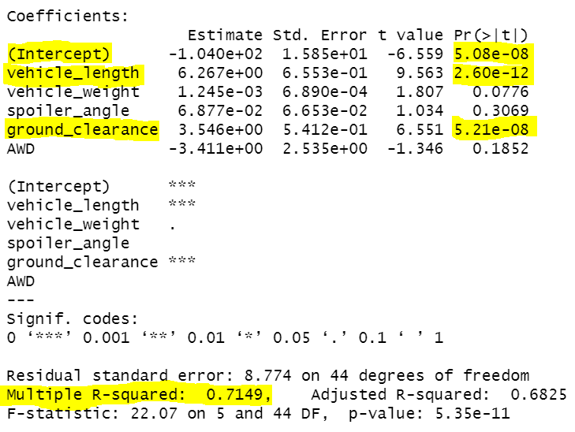
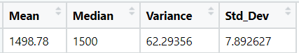
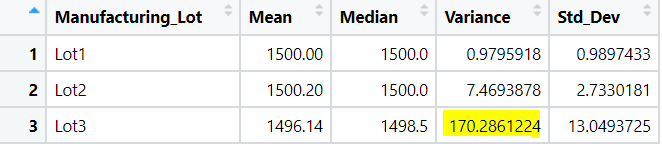

# MechaCar_Statistical_Analysis

## Overview

AutosRUs’ newest prototype, the MechaCar, is suffering from production troubles that are blocking the manufacturing team’s progress

review the production data for insights that may help the manufacturing team.

In this challenge, you’ll help Jeremy and the data analytics team do the following:

## Linear Regression to Predict MPG

Perform multiple linear regression analysis to identify which variables in the dataset predict the mpg of MechaCar prototypes

Q: Which variable coefficients provided a non-random amount of variance to the mpg values in the dataset?

M: Each Pr value in the table above is seen as the probabilty each coefficient gives a random amount of varience to the linnear model.  

A: Using the MechaCar_mpg dataset, vehicle_length and ground clearance are statistically significant. This means vehicle_length and ground_clearance have an impact on mpg.

Q: IS the slope of the linear model considered to be zero? why or why not?

M: Taking a look at the Pr value for the Intercept coefficent.  

A: The slope is not considered to be zero because the intercept coefficent is significant (less than .05). 

Q: Does the linear model predict miles per gallon? why or why not?

A: The Multiple R-squared was 0.71 says that the model does a sufficient job at predicting mpg. This is based off of the general value range betwen 0 and 1 in determination of future data fitting the model. 

## Summary Statistics on Suspension Coils

Collect summary statistics on the pounds per square inch (PSI) of the suspension coils from the manufacturing lots.
Run t-tests to determine if the manufacturing lots are statistically different from the mean population

Q: Does the current manufacturing data meet this design specification for all manufacturing lots in total and each lot individually? Why or why not?

A: The design specifications for the MechaCar suspension coils dictate that the variance of the suspension coils must not exceed 100 pounds per square inch. The variance is 62.29, meaning all manufacturing lots in total meet the design specification. Lot 1 & 2 are within specifications, but Lot 3 has a variance that goes over the specification limits (100 PSI). 

Design a statistical study to compare vehicle performance of the MechaCar vehicles against vehicles from other manufacturers. For each statistical analysis, you’ll write a summary interpretation of the findings.

## Summary 

## Results

### Resources

